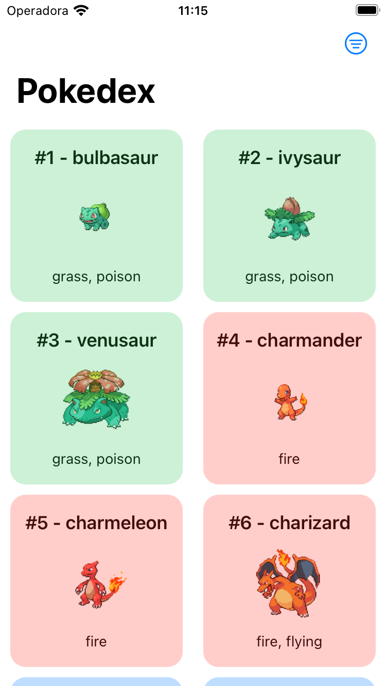
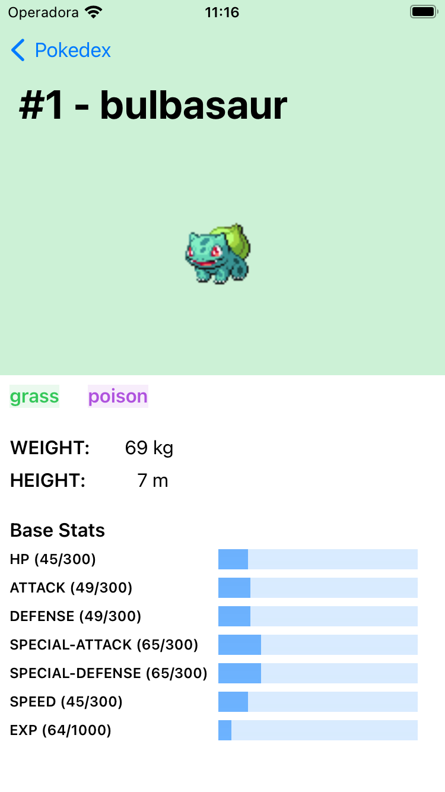
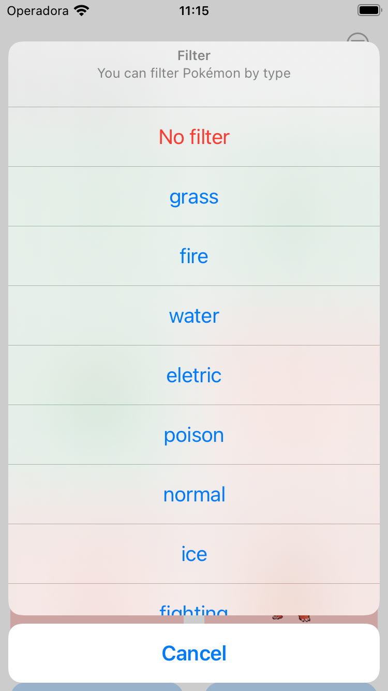
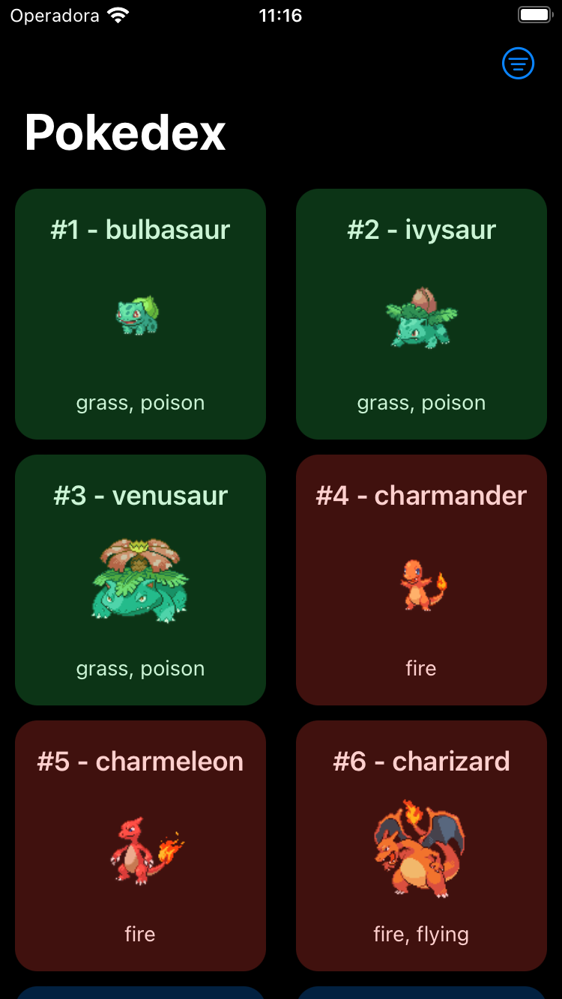
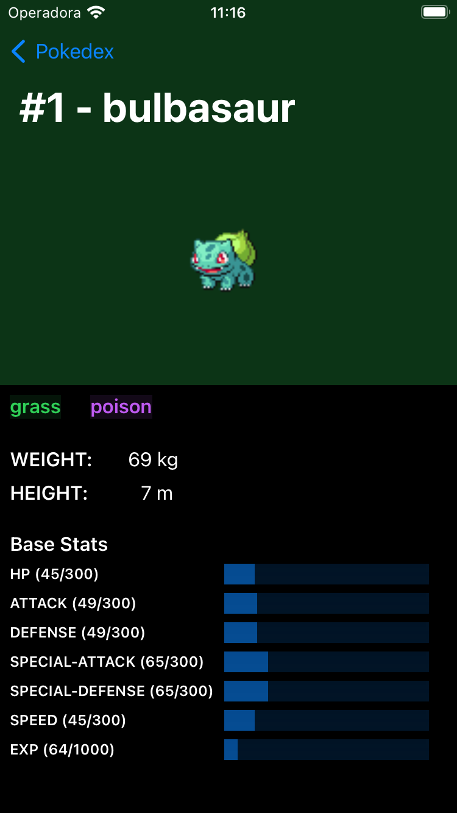

# Pokédex App
This app shows a list and details of Pokémons using [Poké API](https://pokeapi.co/docs/v2).

## Architecture and UI Design Patterns
- On this project's architecture, we have 2 targets following Clean Architecture principles:
    - The first target `PokedexCore` is responsible for holding any business logic. In this project, I'm using just a networking layer, but in the future, we could need to use some database and this logic would live on this target too. This target is platform-agnostic, so we could use it to create an iOS, watchOS, or macOS app and it can be reused from other targets.
    - The second target `Pokedex` contains the app implementation for iOS. For the iOS app UI design pattern, I decided to use MVVM-C, since this is still a small application and this pattern fits well with the idea of the project.
    
## How to run
Go to `Pokedex` folder and open `Pokedex.xcodeproj`. Select `Pokedex` scheme and select an iOS simulator. Then run.

## Features
- Networking with cache
- Unit tests
- MVVM-C
- Filtering
- Pagination
- Dark mode support

## Next steps
- Localization
- Unit tests on MVVM implementation

## Scenes

  
  

  
  

  

